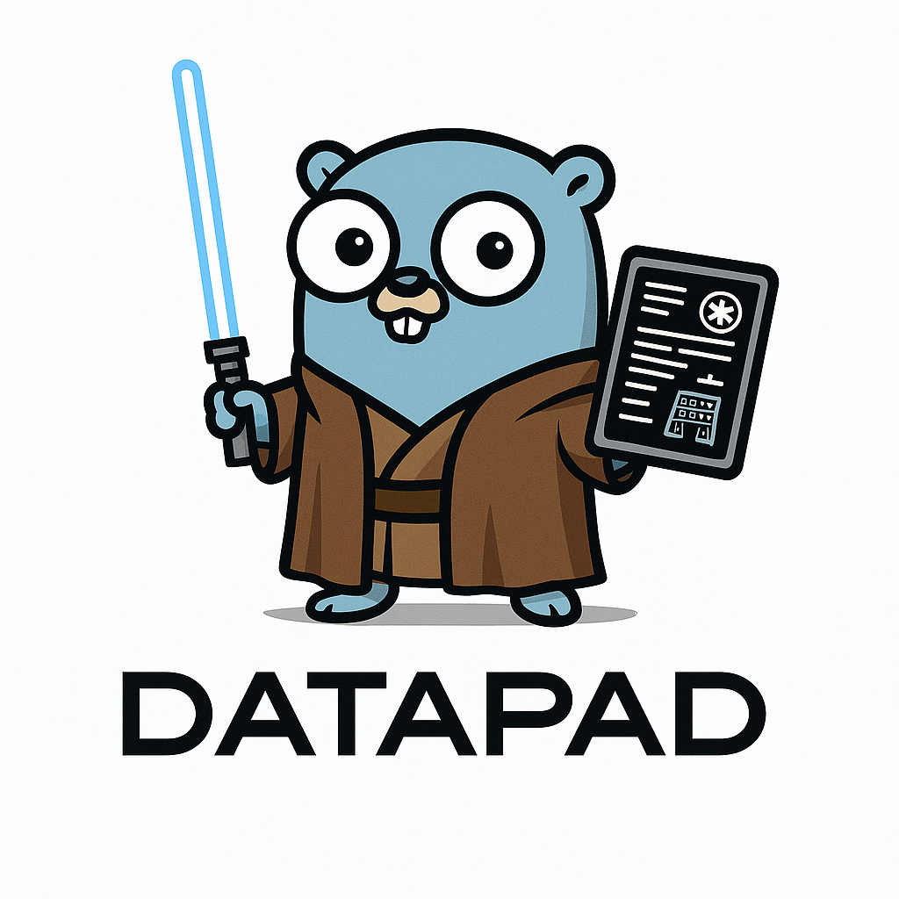

# Datapad

A powerful terminal-based note-taking application written in Go.



## Overview

Datapad is a feature-rich note manager that runs entirely in your terminal. It provides an elegant text-based user interface (TUI) for creating, managing, and organizing your notes without leaving your command line environment.

## Features

- **Terminal-Based Interface**: Clean, intuitive TUI for efficient note management
- **Markdown Support**: Write and format your notes using Markdown syntax
- **Tag Organization**: Add tags to your notes for easy categorization and filtering
- **Image Support**: Import and attach images to your notes with captions
- **Powerful Search**: Quickly find notes by title or content
- **Automatic Saving**: Changes are automatically saved to persistent storage
- **Customizable Storage**: Choose where to store your notes and images

## Installation

### Requirements

- Go 1.18 or higher

### Building from Source

```bash
# Clone the repository
git clone https://github.com/yourusername/datapad.git
cd datapad

# Build the application
go build -o datapad ./cmd/datapad

# Optional: Install to your $GOPATH/bin
go install ./cmd/datapad
```

## Usage

### Basic Commands

```bash
# Run with default storage location (~/.datapad)
datapad

# Specify a custom storage location
datapad -storage /path/to/storage
```

### Key Features and How to Use Them

#### Creating and Managing Notes
- Create new notes with titles and Markdown content
- Edit existing notes with a built-in text editor
- Delete notes you no longer need

#### Organization with Tags
- Add tags to categorize your notes
- Filter notes by tags to find related information quickly
- Get a list of all tags used across your notes

#### Image Management
- Import images into your notes
- Add captions and alt text for better accessibility
- Organize images within your notes

#### Search Capabilities
- Search across all notes by title or content
- Filter search results by tags

## Project Structure

```
datapad/
├── cmd/
│   └── datapad/
│       └── main.go        # Application entry point
├── internal/
│   ├── assets/
│   │   └── images/        # Storage for imported images
│   ├── notes/
│   │   ├── manager.go     # Notes collection management
│   │   └── model.go       # Data models for notes and images
│   └── tui/
│       └── app.go         # Terminal UI implementation
```

## Contributing

Contributions are welcome! Please feel free to submit a Pull Request.

1. Fork the project
2. Create your feature branch (`git checkout -b feature/amazing-feature`)
3. Commit your changes (`git commit -m 'Add some amazing feature'`)
4. Push to the branch (`git push origin feature/amazing-feature`)
5. Open a Pull Request

## License

This project is available under the [MIT License](LICENSE) - see the LICENSE file for details.

## Acknowledgments

- Built with [Bubbletea](https://github.com/charmbracelet/bubbletea) for the TUI framework
- Inspired by the need for a powerful note-taking tool that works entirely in the terminal